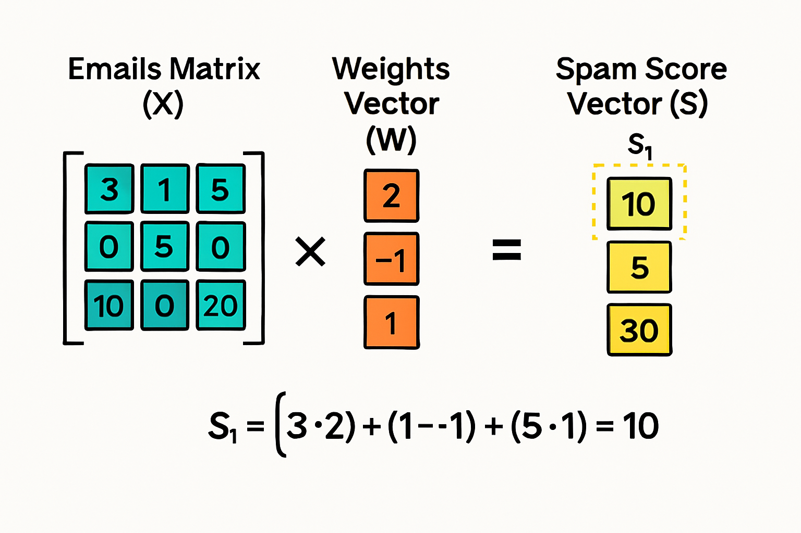

# Mathomong AI Club


# Linear Algebra in Neural Networks: A Beginner's Guide

---

## 🎯 What You'll Learn
By the end of this guide, you'll understand:
* Why neural networks use linear algebra (it's not arbitrary!)
* How matrices organize and transform data.
* The connection between simple high school math and AI magic.

---

## 🌟 Part 1: The Big Picture

### The Core Insight
Neural networks do just **two fundamental things**:

1.  **Matrices** → organize the data into neat rows and columns.
2.  **Matrix multiplication** → transform that data into something more useful.

Every layer in a neural network asks the same question:
> *"Given this organized data, how do I transform it into a better representation?"*

---

## 🔢 Part 2: Starting Simple — The Equation That Powers AI

### Remember $y = mx + b$?
This simple equation from school is the DNA of neural networks:

$$y = mx + b$$

* **$m$ (slope/weight):** Stretches or shrinks the input.
* **$b$ (bias):** Shifts the result up or down.
* **$x$ (input):** Your data.
* **$y$ (output):** The transformed result.

**Example:** If you earn R15/hour (60m=R15), work 8 hours, plus a R20 bonus:
Earnings = 15(8) + 20 = R140

### The Neural Network Version
A single artificial neuron does the exact same thing, just with more numbers:

y = Wx + b

* **$W$** = Weight matrix (like $m$, but for multiple inputs).
* **$x$** = Input vector (your data list).
* **$b$** = Bias vector (the shift).
* **$y$** = Output (transformed data).

---

## 🧩 Part 3: Why Weighted Sums? (The "Aha!" Moment)

### Real-World Example: Spam Detection
Imagine you're checking if an email is spam based on specific words:

| Feature | Value in Email | Weight (Importance) |
| :--- | :--- | :--- |
| Word "FREE" appears | 3 times | **+2** (suspicious) |
| Word "meeting" appears | 1 time | **-1** (normal) |
| Exclamation marks (!) | 5 times | **+1** (suspicious) |

You naturally calculate a **spam score**:

$$Score = (2 \times 3) + (-1 \times 1) + (1 \times 5) + \text{bias}$$
$$Score = 6 - 1 + 5 + 0 = \mathbf{10}$$
*(High score = probably spam!)*

This is exactly what a neuron does:
1.  **Weight** each input by importance.
2.  **Sum** them all together.
3.  **Add bias** for a baseline adjustment.

---

## 📐 Part 4: From One Email to Many — Enter Matrices

### One Email (Vector)
$$x = [3, 1, 5]$$
$$Weights = [2, -1, 1]$$

### Multiple Emails (Matrix)
Instead of calculating one by one, we stack 3 emails into a **Matrix ($X$)**:

$$
X = 
\begin{bmatrix}
3 & 1 & 5 \\
0 & 5 & 0 \\
10 & 0 & 20
\end{bmatrix}
\begin{matrix}
\leftarrow \text{Email 1} \\
\leftarrow \text{Email 2} \\
\leftarrow \text{Email 3}
\end{matrix}
$$



Instead of loops, **matrix multiplication** calculates all scores simultaneously:

```python
scores = X @ weights + bias
# Boom! All 3 spam scores calculated at once

```
-----

## 🎨 Part 5: Transformations — Seeing Data Differently

### The House Analogy

Transforming data in each layer is like examining a house:

* **Front view** → see the door and windows.
* **Side view** → see the depth and roofline.
* **Dig beneath** → find the foundation.

Each neural network layer looks at your data from a different "angle" (applies a different transformation), revealing new patterns that weren't obvious before.

### What Transformations Do

Linear transformations can:

* **Rotate** the data (change perspective).
* **Stretch** or **shrink** it (zoom in/out).
* **Shear** it (skew the angle).

**Goal:** By the final layer, the data is transformed so well that different categories separate easily—like sorting apples from oranges after they've been arranged clearly.

-----

## 🔄 Part 6: The Neural Network Layer Formula

### The Complete Layer

$$output = activation(X \cdot W + b)$$

Breaking it down:

1.  **$X \cdot W$ (Matrix Multiplication)** $\rightarrow$ **Linear Transformation**

* *X:* your data (batch\_size × input\_features)
* *W:* learned weights (input\_features × output\_features)
* **Geometric Effect:** Rotates, stretches, and skews the data space.

2.  **$+ b$ (Addition)** $\rightarrow$ **Translation**

* *b:* bias vector
* **Geometric Effect:** Shifts the data (moves the origin) so the activation function fits better.

3.  **$activation(...)$** $\rightarrow$ **The Nonlinear "Bend"**

* *Examples:* ReLU, Sigmoid, Tanh
* **Geometric Effect:** Warps the space. This lets the network learn curves, not just straight lines. Without this, deep learning would collapse into simple linear regression\!

### Dimensions Tell the Story

$$Input: (100 \text{ emails}, 3 \text{ features})$$
$$Weights: (3 \text{ features}, 10 \text{ neurons})$$
$$Output: (100 \text{ emails}, 10 \text{ features})$$

You're transforming 3 simple features into 10 new, richer features.

-----

## 🥞 Part 7: The Bridge — Flattening

Before you can use the formula above ($X \cdot W$), your data **must** be a flat list (vector). But what if your data is a 2D grid, like an image?

### Square Peg, Round Hole
* **Image Data:** A grid (Height $\times$ Width).
* **Linear Layer:** Expects a flat list ($1 \times$ N).

**Flattening** is the translator. It takes a grid and "unrolls" it into a single long line of numbers.


### The Analogy: Reading a Paragraph
Think of an image like a paragraph of text.
* On the page, it has a 2D shape (rows and columns of words).
* When you read it aloud over the phone, you read it as **one long stream of words**.

Flattening is simply reading the image pixels row-by-row until it becomes a stream of data ready for the neural network math.

$$
\begin{bmatrix} 
1 & 2 \\ 
3 & 4 
\end{bmatrix}
\hspace{1cm}
\xrightarrow{\text{Flatten}}
\hspace{1cm}
[1, 2, 3, 4]
$$

## 🌊 Part 8: Deep Learning = Stacking Transformations

### One Layer vs. Many Layers

* **One layer:** Can draw straight lines to separate data (Limited).
* **Many layers:** Can draw complex curves and shapes (Powerful\!).

Think of approximating a circle:

* **1 straight line:** A poor approximation.
* **10 straight lines:** A decent decagon.
* **100 straight lines:** Almost a perfect circle.

**Example: Image Recognition**

* **Layer 1:** Detects edges (lines).
* **Layer 2:** Combines edges into shapes (circles, squares).
* **Layer 3:** Combines shapes into parts (eyes, wheels).
* **Layer 4:** Combines parts into objects (faces, cars).

-----

## ⚡ Part 9: Why Matrices Are Essential

### The Physics of Computing

Your brain has \~86 billion neurons. Modern AI models have trillions of parameters.

* **The Problem:** If we processed one number at a time (like a CPU loop), training would take **thousands of years**.
* **The Solution:** GPUs (Graphics Cards). They are designed to process pixels in grids (matrices) for video games. It turns out, this is exactly what AI needs.

**Bottom line:** Matrix multiplication is the cheapest, fastest computation on Earth. Neural networks are designed around it for speed.

-----

## 🎓 Part 10: The Historical Journey

* **1943 — The Beginning:** McCulloch & Pitts model neurons as weighted sums (Linear Algebra emerges naturally).
* **1958 — Learning:** Rosenblatt's Perceptron learns weights automatically.
* **1986 — Deep Networks:** Backpropagation allows us to train multiple layers.
* **2012 — The Revolution:** GPUs make matrix operations so fast that Deep Learning finally becomes practical.

-----

## 🔑 Key Takeaways

1.  **Linear algebra provides structure:** Matrices organize data efficiently.
2.  **Matrix multiplication transforms data:** Like looking at an object from different angles.
3.  **Nonlinear activations add flexibility:** Let networks learn curves, not just lines.
4.  **It's all about patterns:** The world is full of patterns, and neural networks are pattern-detection machines powered by math.

**Neural networks aren't mysterious.** They are just:

* Taking data (Matrices)
* Transforming it repeatedly (Multiplication)
* With small "bends" between steps (Activation)
* ...Until the answer becomes obvious.

-----

## 🚀 What's Next?

Now that you understand the foundations:

* **Practice:** Play with simple neural networks on Google Colab.
* **Visualize:** Watch 3Blue1Brown's neural network series.
* **Connect:** Join the conversation in the **Mathomong AI Club** Discord\!

*"The only way to learn mathematics is to do mathematics." — Paul Halmos*

**Welcome to the Mathomong AI Club\!**

